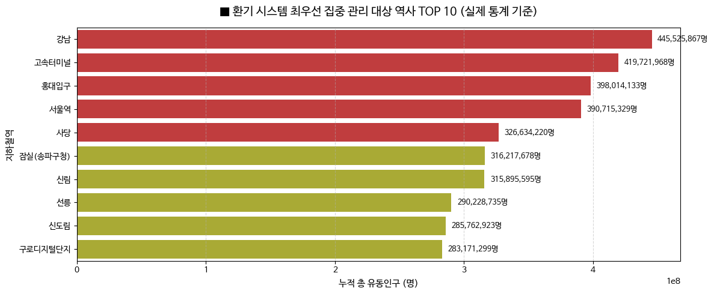

# AI-Driven Smart Ventilation Optimization System (Seoul Metro)

An AI-powered proactive ventilation control system that optimizes indoor air quality and energy efficiency using Seoul Metro passenger flow data.

---

## Project Overview

Traditional subway ventilation systems operate reactively, increasing ventilation only after congestion or air quality issues occur.

This project proposes a **data-driven smart ventilation strategy** that predicts congestion patterns using historical passenger flow data and proactively adjusts ventilation operations.

---

## Problem & Solution (SCQA)

### Situation
Seoul Metro manages indoor air quality using real-time monitoring systems such as air sensors and passenger information.

### Complication
Current ventilation operations are mainly reactive, causing:
- Delayed response during peak congestion
- Unnecessary energy consumption during low-demand periods

### Question
Can historical passenger patterns be used to predict congestion and optimize ventilation in advance?

### Answer
Develop a spatial-temporal smart ventilation strategy that activates ventilation before predicted congestion peaks.

---

# Data Analysis

## 1. Temporal Analysis (When)

Passenger flow analysis identified clear peak patterns during commuting hours.

**Key Findings**
- Passenger flow shows a double-peak pattern during commuting hours
- Peak and off-peak periods have statistically significant differences (Welch's t-test)

Based on these patterns:

- **Peak Mode (08:00–09:00, 18:00–19:00)**  
  → Increase ventilation capacity during high-density periods

- **Eco Mode (11:00–15:00)**  
  → Reduce unnecessary ventilation during low-demand periods

---

## 2. Spatial Analysis (Where)

Station-level passenger volume analysis identified high-congestion hubs.

**Key Findings**
- Major stations show significantly higher passenger concentration
- Ventilation resources should be prioritized for high-density stations
- High-demand stations require differentiated ventilation strategies

---

# Tech Stack

- Python
- Pandas / NumPy
- Matplotlib / Seaborn
- Scikit-learn
- Jupyter Notebook
- Statistical Testing (Welch's t-test)

---

# Proposed Strategy

### Spatial-Temporal Smart Control

| Strategy | Approach |
|---|---|
| Time-based Control | Adjust ventilation according to passenger demand patterns |
| Station-based Control | Prioritize high-congestion stations |
| Energy Optimization | Reduce unnecessary operation during low-demand periods |

---

# Expected Impact

- Proactive Air Quality Management  
Predict congestion before it occurs and maintain better indoor air quality.

- Energy Cost Reduction  
Avoid unnecessary ventilation during low passenger periods.

- No Additional Hardware Required  
Utilize existing passenger data and infrastructure.

---

## Dataset

**Seoul Metro Passenger Boarding and Alighting Data**

- Station-level passenger flow data
- Hourly boarding and alighting counts
- Used to analyze congestion patterns and demand changes
